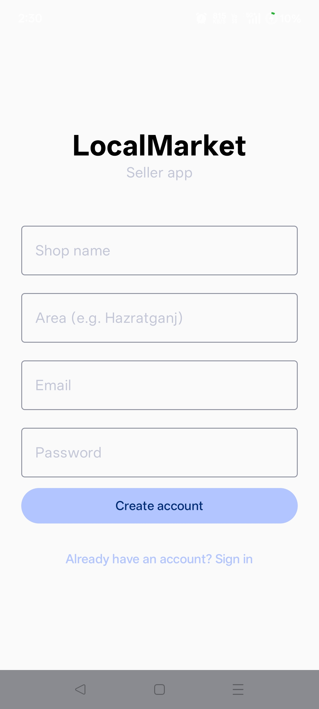
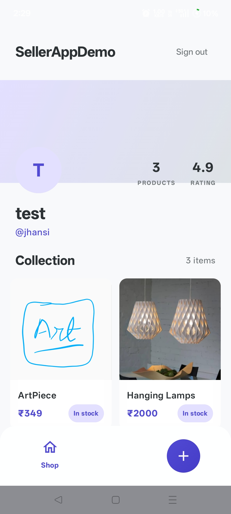
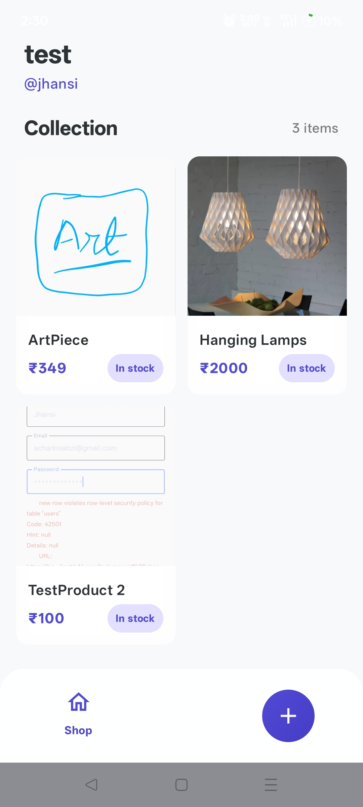
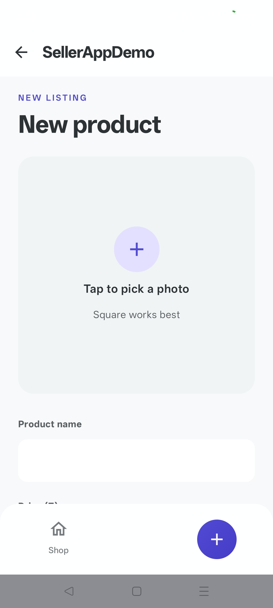
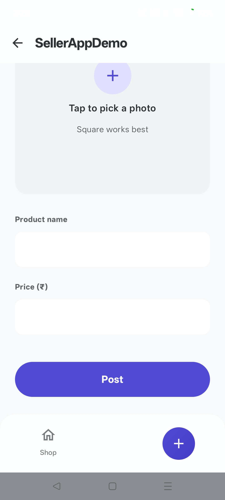
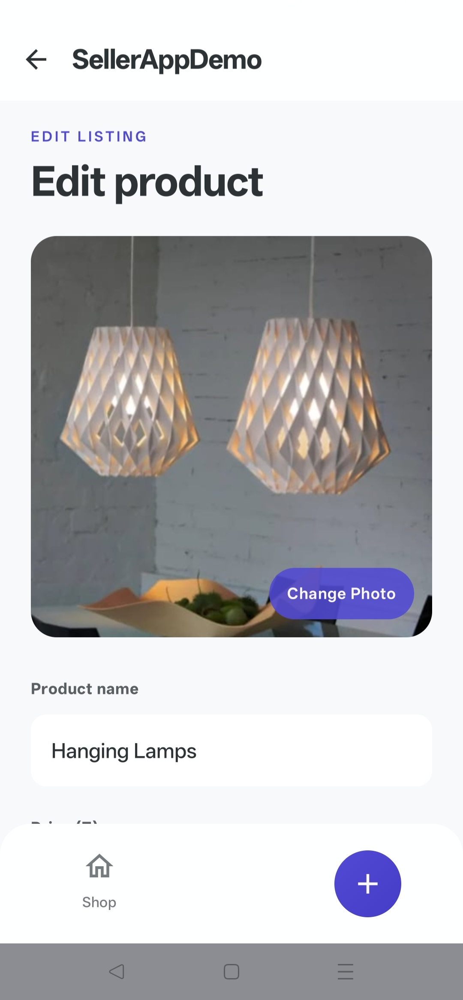
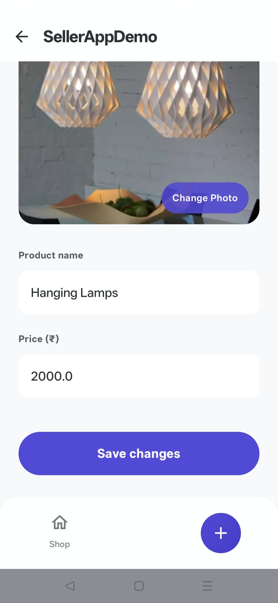

# SellerAppDemo

An Android app for local shop owners to manage their product listings. Built as part of a two-app marketplace system alongside [BuyerAppDemo](https://github.com/acharkisabzi/BuyerAppDemo).

## Screenshots

**Authentication**

<p align="center">
  
  &nbsp;&nbsp;
  
</p>

**Shop feed**

<p align="center">
  
  &nbsp;&nbsp;
  
</p>

**Add product**

<p align="center">
  
  &nbsp;&nbsp;
  
</p>

**Edit product**

<p align="center">
  
  &nbsp;&nbsp;
  
</p>

## Features

- **Sign in / Sign up** - Email and password authentication with persistent session
- **Shop profile** - Avatar, product count, rating, shop name, and area displayed on the home feed
- **Product collection** - 2-column grid of all your listed products with prices and stock status
- **Add product** - Pick a photo from the gallery, enter a name and price, and post instantly
- **Edit product** - Tap any listing to update its photo, name, or price and save changes
- **Live backend** - Products appear in the Buyer app the moment they're posted

## Tech Stack

| Layer | Technology |
|---|---|
| UI | Jetpack Compose + Material 3 |
| Architecture | MVVM (ViewModel + StateFlow) |
| Navigation | Compose Navigation with type-safe routes |
| Backend | Supabase (Auth, Postgrest, Storage) |
| Image loading | Coil 3 |
| Language | Kotlin |

## Architecture

The app follows MVVM with a unidirectional data flow pattern:

```
LoginScreen / ShopFeedScreen / AddProductScreen / EditProductScreen
        │
        ▼
  AuthViewModel / ShopFeedViewModel / ProductActionViewModel
        │
        ▼
   Supabase client (Auth + Postgrest + Storage)
```

- **UI state** is modelled as immutable data classes (`AuthState`, `ShopFeedState`, `ProductActionState`)
- **StateFlow** exposes state from ViewModels; screens collect it with `collectAsState()`
- **Navigation** uses Compose Navigation - `ProductModel` is passed as a type-safe route object directly to `EditProductScreen`
- **Image upload** - photos are picked from the device gallery, read as a byte stream, and uploaded to Supabase Storage; the resulting public URL is saved alongside the product record
- **Session persistence** is handled by `SettingsSessionManager` so users stay logged in across app restarts

## Setup

### Prerequisites
- Android Studio Hedgehog or newer
- A Supabase project (free tier works fine) - the same project used by BuyerAppDemo

### Supabase schema

**`users`** (sellers)
| column | type |
|---|---|
| id | uuid (references auth.users) |
| shop_name | text |
| area | text |
| email | text |

**`products`** (shared with Buyer app)
| column | type |
|---|---|
| id | uuid |
| shop_id | uuid |
| shop_name | text |
| area | text |
| name | text |
| price | float8 |
| image_url | text |
| in_stock | boolean |

You'll also need a **Storage bucket** named `products` with public read access for product images.

### Configuration

1. Clone the repo:
   ```bash
   git clone https://github.com/acharkisabzi/SellerAppDemo.git
   ```

2. Add your Supabase credentials to `local.properties`:
   ```properties
   SUPABASE_URL=https://your-project.supabase.co
   SUPABASE_KEY=your-anon-key
   ```

3. Build and run on a device or emulator (API 26+).

## Related

- **[BuyerAppDemo](https://github.com/acharkisabzi/BuyerAppDemo)** - the companion buyer-side app where customers browse and view products listed by sellers